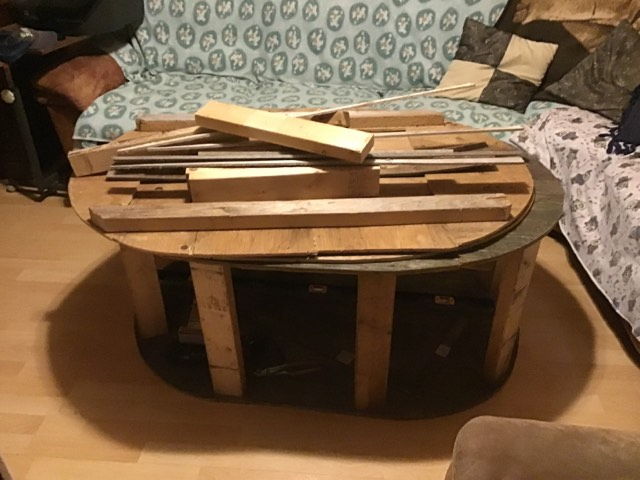

## réussite

## Tâches effectuées

Jordan Dallaire : À réglé et programmé l'IA pour qu'elle puisse se déplacer en suivant les checkpoints, lesquels se déplacent tous les 5 secondes le long de l'axe des x. Il a également créé une animation d'introduction au début de la course, ainsi qu'une attente de 3 secondes avant le début de la course.

Jean-Chrystophe Fréreault : A fini de composé la vidéo de présentation du sprint 2 

Filip Vojinovic : À mis sur les réseaux sociaux des posts, avancement des assets, construction de la ville cyberpunk, j'ai réglé certaine courbature sur le terrain qui est sur Unity

et c'est avancé dans la construction des base des banc.

### Image de l'intro

### Script de l'IA

### Partie du script départ 

## Difficultés et défis
Jordan Dallaire : L'IA a été beaucoup plus difficile à programmer que je ne le pensais. Le comportement n'est pas parfait, j'ai rencontré un problème où l'IA suivait les checkpoints, mais ne mettait pas à jour leurs positions lorsqu'ils se déplaçaient. Heureusement, ce problème a été résolu.

## échec
