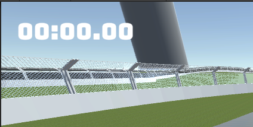

## réussite

## Tâches effectuées

Jean-Chrystophe: Je me suis avancé dans la construction du banc et est fini les structures des deux bases à l'exception des arrêts qui manquent. Les bancs ne manquent qu'à joindre les dossiers et fessier. 

Jordan Dallaire : A programmé les scripts des power-ups et a commencé la création de certains grâce au ScriptableObject (Sabotage et Buff-Vitesse). A ajouté la fonctionnalité permettant d'activer un power-up en appuyant sur un bouton d'arcade. A également intégré une fonction pour détecter les couches que les joueurs traversent, permettant ainsi de ralentir les joueurs s'ils passent sur la couche de gazon ou de ne rien faire s'ils sont sur la piste.

### Script de base qui sert à tous les power ups

### Script du power ups Buff Vitesse

### Script de détection des couches au contact du sol par le joueur

### Fonction pour l'activation d'un power ups à l'aide d'un bouton

### Fonction pour désactiver le power ups selon son cooldown

### Le compteur de la course

Shayne Fortier a travaillé sur le compteur de temps pour calculer le temps que le joueur a pris pour finir la course par rapport aux adversaires. C'était simple, il n'avait qu'à récupérer le code qu'il avait fait dans le cours de média interactif 2 qui comprenait à réaliser des jeux en 2D avec Unity.

Filip Vojinovic : À fait quelques assets sur Blender, changement sur le terrain incluant les ajouts et enlèvements de bâtiments sur Unity. J'ai fait les publications sur les réseaux sociaux et j'ai ajouté et réorganisé le dossier de son.

### Le classement dans la course

Shayne a complété le classement. À la ligne d'arrivé, il enregistre le véhicule dans un ScriptableObject afin que ces informations puisse être utiliser par un autre module comme pour l'écran de fin qui montre le résultat final et annonce le gagnant.

Nicholas: A fait les auto tamponneuses de style cyberpunk.
### Auto tamponneuse 
[Rendu final de la première auto tamponneuse](../medias/CyberCar_01.png)
[Rendu final de la deuxième auto tamponneuse](../medias/CyberCar_02.png)
[Rendu final de la troisième auto tamponneuse](../medias/CyberCar_03.png)

## Difficultés et défis

## échec