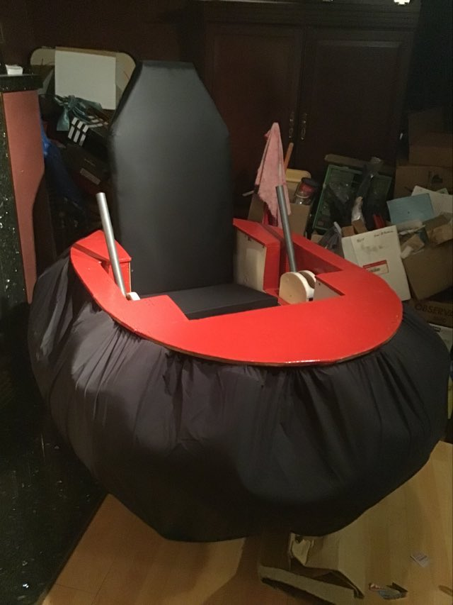

## réussite

## Tâches effectuées
Jean-Chrystophe Fréreault:les autos temponeuses son terminer sauf le manque de peinture a certain endroit. il ne reste qu'a installer les fille électric et le arduino et on peut dire qu'il n'y a plus rien a faire pour.
 

Nicholas: Avancement des map Cyberpunk et Cartoon. Création du script pour les voitures volantes du monde cyberpunk.

Jordan Dallaire : A travaillé principalement à corriger le plus grand nombre possible de problèmes liés aux IA et à leurs emplacements de checkpoints, à effectuer des corrections de bugs concernant les power-ups, à améliorer le mode chaos en ajoutant deux nouvelles cartes et deux nouveaux effets (Cartoon et Cyberpunk), ainsi qu'à effectuer des réglages de bugs. Il a également ajouté les sons dans le jeu, collaboré avec l'aide de Shayne Fortier sur le mode multijoueur, intégré les modèles 3D pour les power-ups et les a dispersés sur toute la carte. De plus, il a ajouté un compteur de temps pour le mode chaos avant l'apparition du prochain effet (barre bleue en haut de l'écran) et a également affiché le nom de l'effet du mode chaos toutes les 30 secondes et a réalisé la vidéo capsule sur l'avancement du projet.

### Liste checkpoints des ennemis

### Petite partie du code du mode chaos

### Emplacement des powers ups

### Affichage du temps et du nom des effets chaos

## Difficultés et défis

Jean-Chrystophe Fréreault : les levier m,on donner de grande dificulter et la dificulter d'assemblage dans les temp demander mais j'ai réussi a fini le 29 a 1:30 am.

## échec