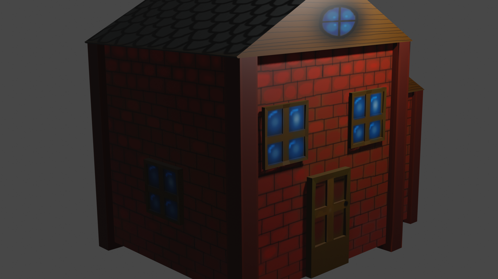
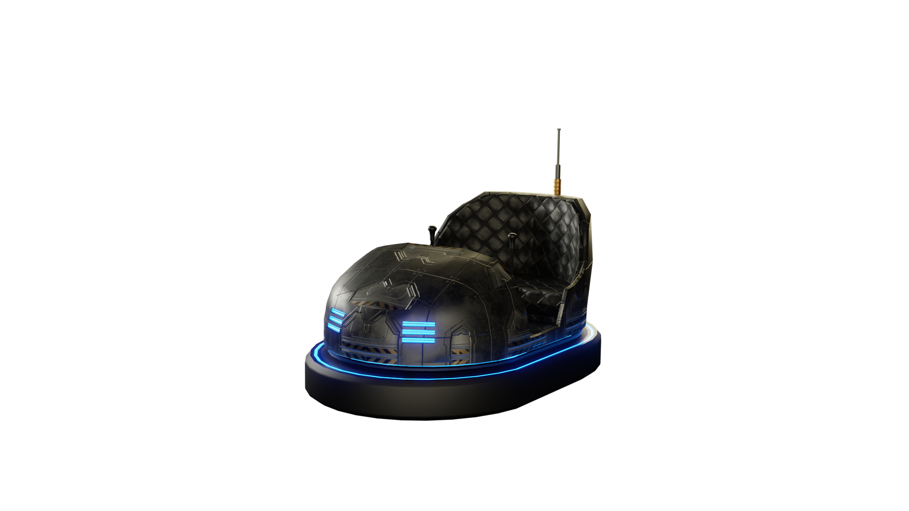
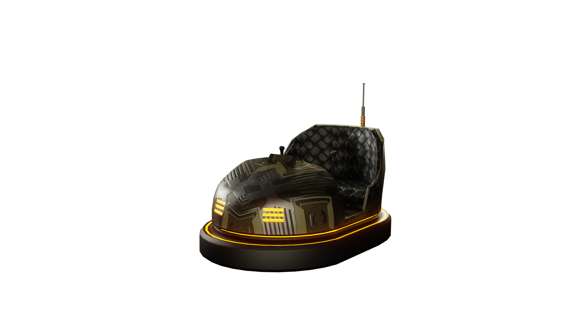
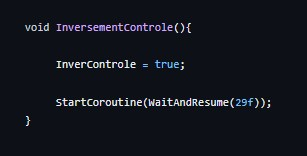
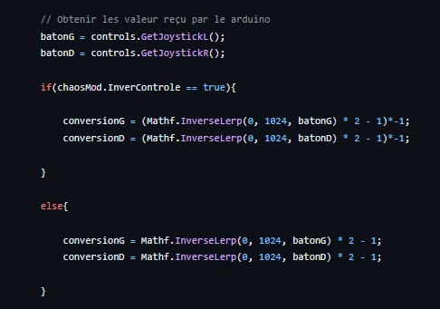
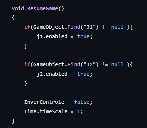

## réussite

## Tâches effectuées
Jean-Chrystophe Fréreault:terminer de faire les maisons et l'église en 3D pour la map cartoon. Elles ont toute leurs textures et les nomarles ne sont pas inversé. 

Jean-Chrystophe Fréreault: À optimisé tout les model des batiment de la map Cartoon. 

Nicholas Desroches: A fait deux autres modèles de voitures de style cyberpunk. et il a aussi rendu la track plus étroite suite au commantaire de la général. Il a aussi rajouter des barrières le long de la montagne.

Jordan Dallaire : A aidé à installer le projet lors de la générale du 29 novembre, avec l'assistance de toute l'équipe. A ajouté un effet pour le mode chaos Inversion de contrôle, a corrigé le bug des power-ups pour les joueurs réels, ainsi que le problème où les joueurs étaient propulsés s'ils avançaient pendant l'effet de gel du mode chaos. A également ajouté un centre de masse à tous les véhicules pour éviter qu'ils ne se renversent.

### Effet chaos inversement contrôle

### Effet chaos inversement contrôle pour le script voiture (suite)

### Correction du bug lors du gèle pour le mode chaos

## Difficultés et défis

## échec