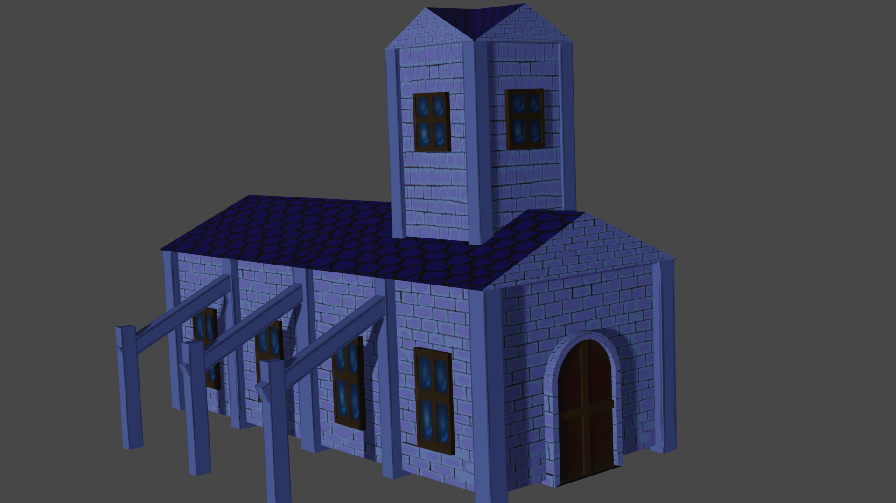

## réussite

## Tâches effectuées
Jean-Chrystophe Fréreault:terminer de faire les maisons et l'église en 3D pour la map cartoon. Elles ont toute leurs textures et les nomarles ne sont pas inversé. 

## Difficultés et défis

## échec