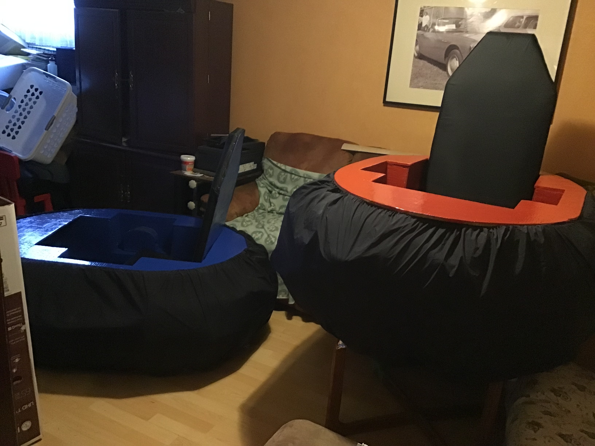
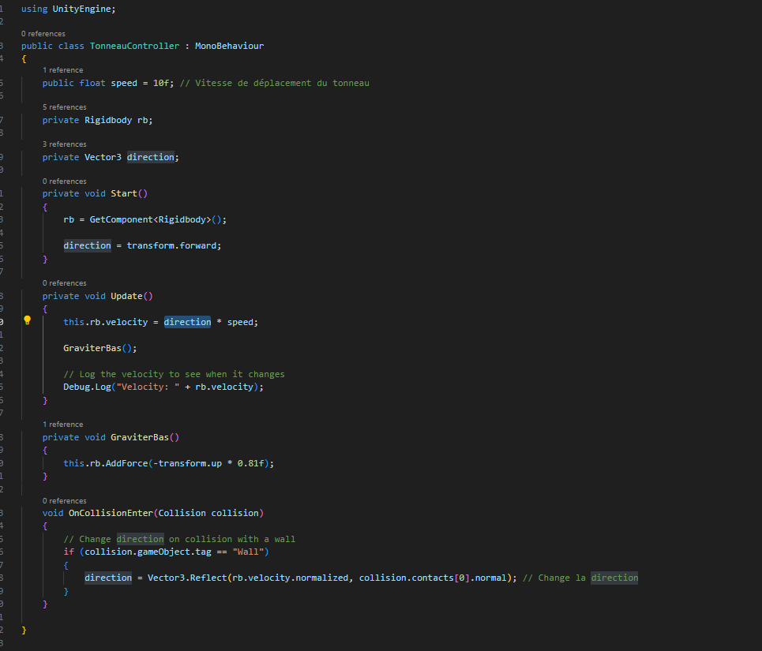
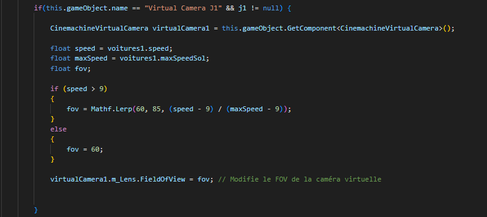

## réussite

## Tâches effectuées
Nicholas Desroches: A rajouter des rues dans la ville Cyberpunk, il a aussi animé les billboards de la ville, il a aussi animé les lumières du début de la course et réglé le bug du post prosessing de unity. 

Jean-Chrystophe Fréreault: A terminer les bancs a grater pour elever la peinture mal mise et a réapliquer la peinture et terminer cette dernière. afini de faire les nouvelle boite pour les levier. 

Jordan Dallaire :  A ajouté une gravité personnalisée au jeu, car le moteur Unity ne fonctionnait pas très bien avec notre jeu. A résolu le problème du power-up tonneau, assurant son déplacement correct ainsi que son rebond sur les murs. Les corrections sont toujours en cours pour ce qui concerne les déplacements des véhicules en marche arrière.A ajouté un effet de champ de vision (FOV) à la caméra pour simuler la vitesse lorsque le joueur se déplace rapidement. Les mises à jour sont toujours en cours concernant les intelligences artificielles et leurs déplacements, qui nécessitent des corrections.

### Script power-up Sabotage (tonneau)

### Script pour le FOV

## Difficultés et défis

## échec