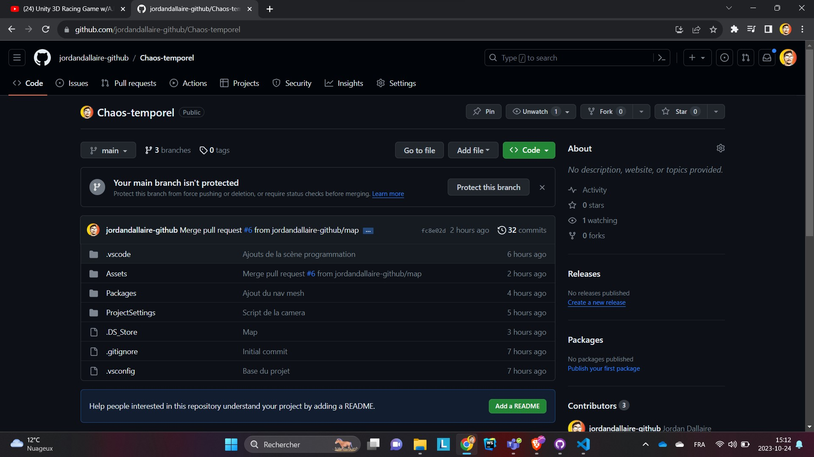

## Consignes

Votre journal doit inclure un résumé de la semaine, vos bon coups et réussites, les difficultés et défis, ainsi que les tâches effectuées.

Vous devez inclure des images, liens et autre contenu nécéssaire pour supporter vos explications et montrer l'avancement du projet.

## Réussites

aucune

## Tâches effectuées

Jordan Dallaire : Création du répertoire du projet Unity, programmation du nouveau système de mouvement prenant en compte le Rigidbody pour la physique, mise en place de la base du NavMesh pour l'IA ennemie. (Travail effectué en parallèle avec Shayne Fortier)

Github : 

--> Jean-Chrystophe: Création de model 3D et correction des mesure liées à l'emplasement de la scene dans la maquettes scénographiqueune dimension de 16pied par 16pied par 8ped. 

création d'élément 3D additionnel pour meumbler l'intérieur de la course.

Nicholas Desroches: Création d'élément 3D pour a ajouter dans la course et début de l'intégration de la map sur Unity.

.

## Difficultés et défis
Jordan Dallaire : L'utilisation de GitHub pour notre projet comporte en soi un risque, notamment en ce qui concerne les problèmes de fusion, d'espace, etc. L'un des principaux défis de cette semaine est la programmation de l'IA ennemie, réalisée en collaboration avec Shayne. Celle-ci doit adopter les mêmes comportements que le joueur, tout en étant capable de suivre le parcours de la course, en évitant les joueurs sur la piste ainsi que les objets pouvant être dynamiques.

Voici un exemple avec le nav mesh tiré d'une vidéo de démonstration  :
[exemple du nav mesh](https://www.youtube.com/watch?v=TTOHsdEmKko)

## Échecs

--> Jean-Chrystophe: aucun a reporté. 