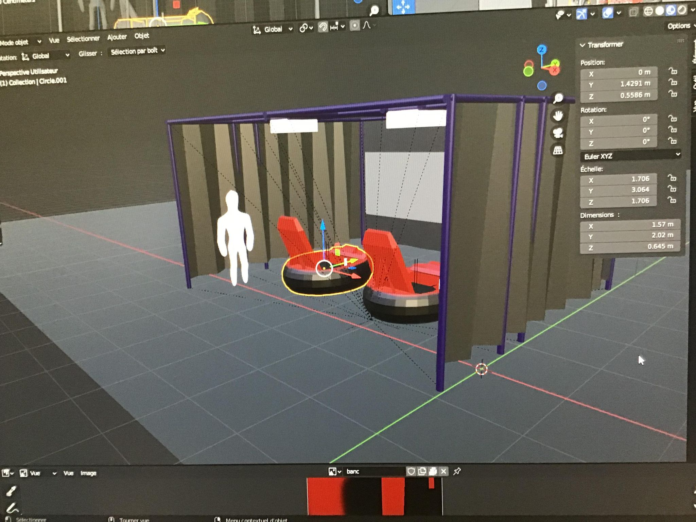

## Consignes

Votre journal doit inclure un résumé de la semaine, vos bon coups et réussites, les difficultés et défis, ainsi que les tâches effectuées.

Vous devez inclure des images, liens et autre contenu nécéssaire pour supporter vos explications et montrer l'avancement du projet.

## réussite

--> Jean-Chrystophe: Création de model 3D et correction des mesure liées à l'emplasement de la scene dans la maquettes scénographiqueune dimension de 16pied par 16pied par 8ped. 

création d'élément 3D additionnel pour meumbler l'intérieur de la course. 

## échec

--> Jean-Chrystophe: aucun a reporté. 