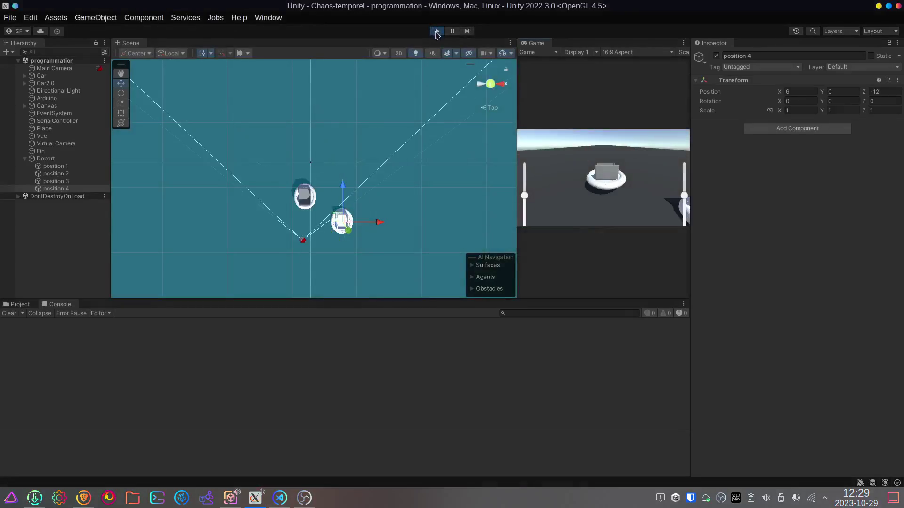

## réussite

## Tâches effectuées

Shayne Fortier a pris la charge de programmer le point de départ et le point d'arrivée. Le point de départ permet de placer aléatoirement les joueurs et les adversaires aux places attitrées sans s'empiler un sur l'autre. Il a pu l'accomplir en plaçant un GameObject vide qui est le parent de quatre autres GameObjects vides afin de garder en mémoire les coordonnées de la position. Cela permet de changer dynamiquement le positionnement sans devoir réécrire les coordonnées à la main dans le code.

Avec l'aide de Phind (un moteur de recherche IA pour les programmeurs), il a réalisé le code en ayant un champ pour pouvoir inclure les véhicules des joueurs et des adversaires. Ensuite, il cherche les GameObjects enfants et stocke les coordonnées Vector3 de la position de chacun en fonction de la position de chacun. Ensuite, on fait une boucle qui place les véhicules aléatoirement sans occuper la même place.

Jean-Chrystophe a monté une video promotionnel liée à l'avancement générale de projet.

Jean-Chrystophe a fais de grand avancement dans le mesurage et le découpage des pièces en bois pour le banc et la base de se dernier.

### Avant

### Code de point de départ

### Résultat

Pour ce qui est du point d'arrivée, il a un collider trigger qui place le joueur ou l'ordinateur dans un tableau produisant un classement. Ce qu'il resterait à faire est de produire un Scriptable Object pour permettre au autre script de prendre l'information ou un moyen de la partager.

Jordan Dallaire a programmé la collision entre les joueurs et a créé un système de checkpoint pour guider l'IA vers la fin de la course.

### Script de collision des joueurs

### Script pour gérer les checkpoints

## Difficultés et défis

## échec
